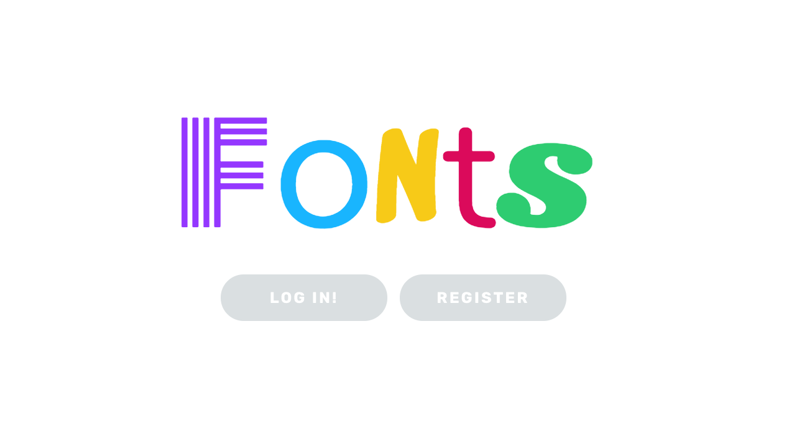
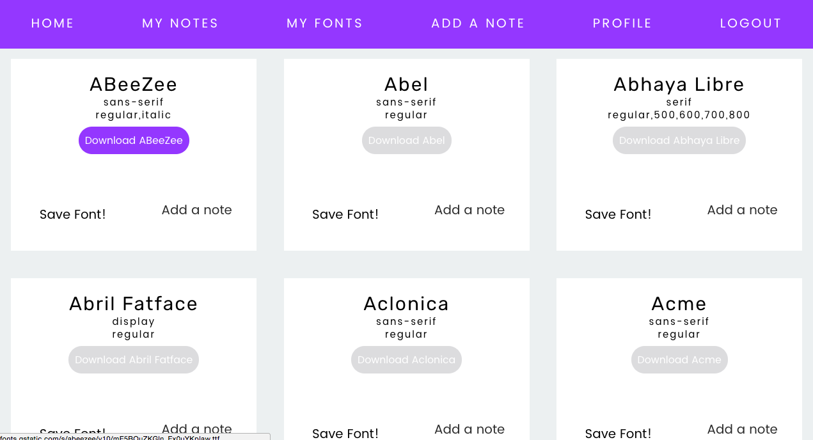
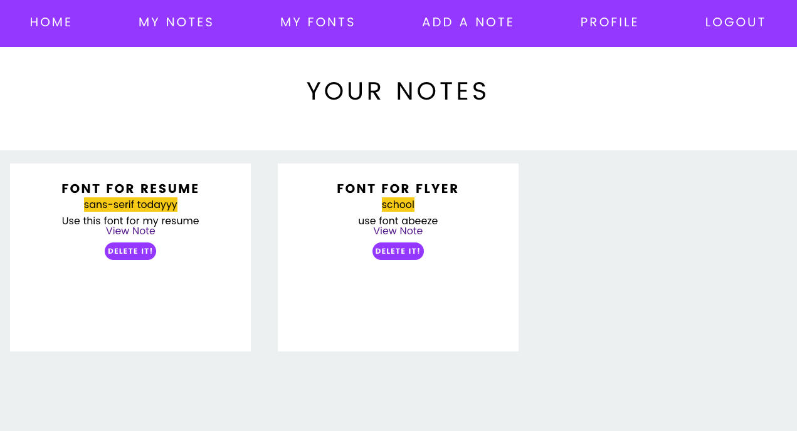
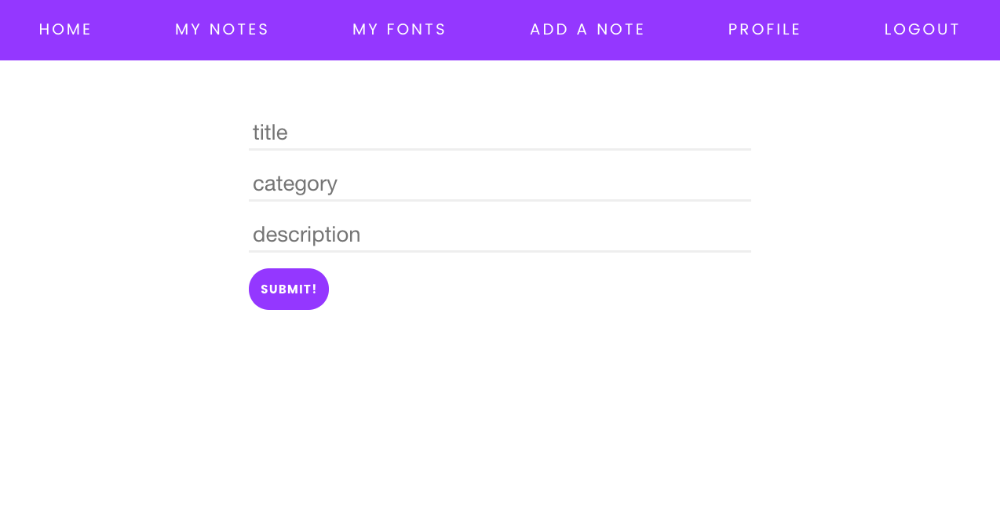

# FONTS APP

## What is fonts?
It is an app that has a library of fonts for you to download. You have to register first in order to access our font library, once you are logged in you can save the fonts that you like and also add notes.

## User stories
-- user should be able to login in order to access the content of the app and his/her profile.

-- user should be able to search for fonts

-- user should be able to download a specified font

-- user should be able to save/store fonts to his/her profile

## Database
users 
-id
-username
-email
-password
-first name
-last name

fonts
-family
-category
-variants
-files
-user_id

notes 
-title
-category
-description
-user_id

## Technologies used
HTML and EJS
Node and Express
MVC software design pattern
SQL / pg-promise
CSS
jQuery

## Future improvements
My initial concept of making a designer assistant app could not be possible due to several complications I had with the APIs I chose. Some improvements I could work on are:
- To display the style of the font, as of now all fonts have the same typeface which defeats the purpose of the app, because the user is supposed to see how the font looks like

- A search feature where the user can browse fonts based on filters like font family, category, style and variants.

This project was very difficult for me to complete, but in the end it was a great learning experience. Even though I did not get the result I had planed, I learnt that this is a learning process and I should be patient and of course keep on practicing and learning to better myself as a developer. 
